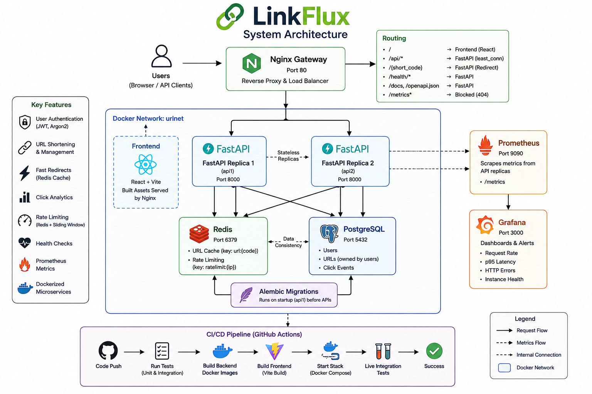
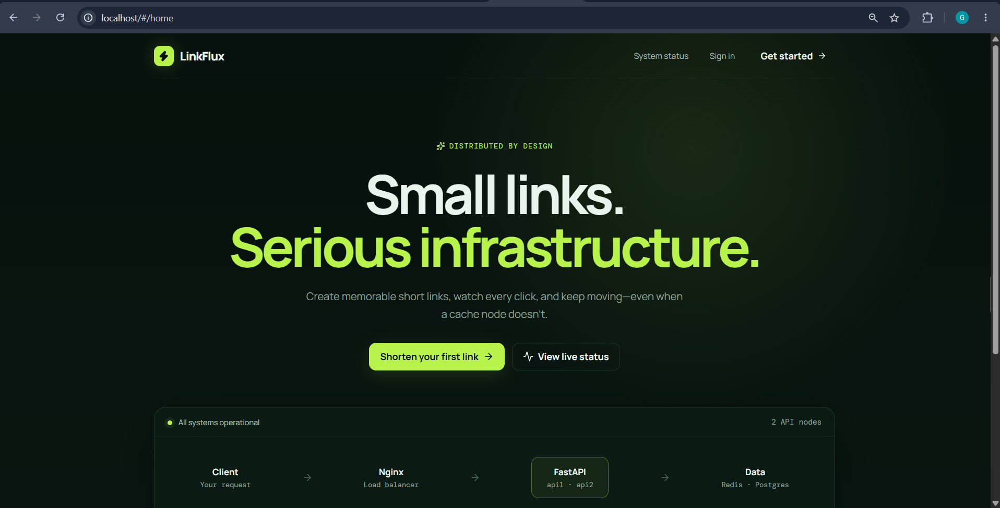
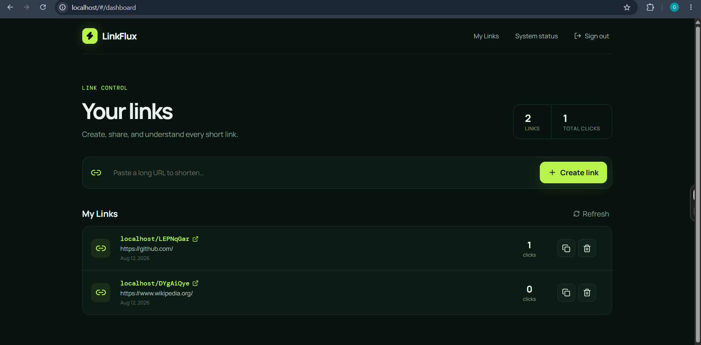
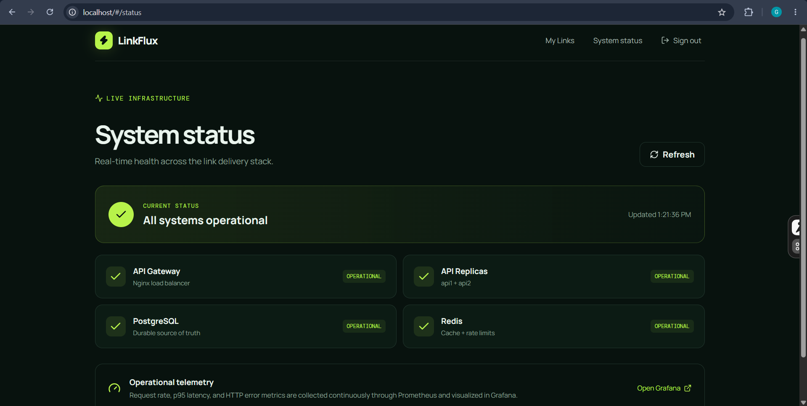
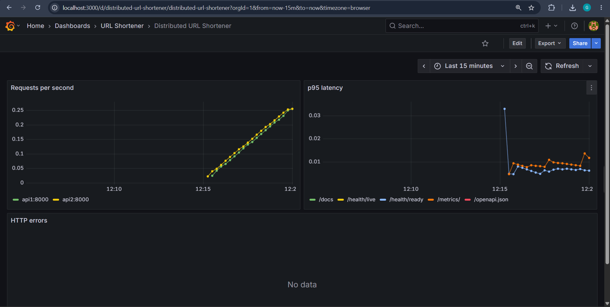
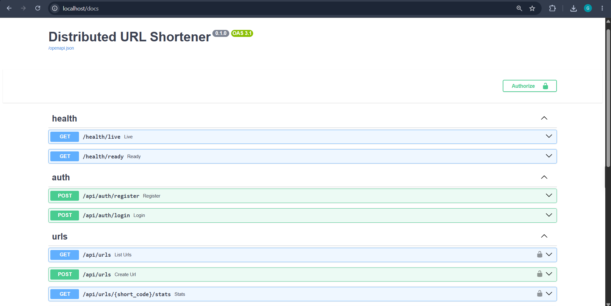
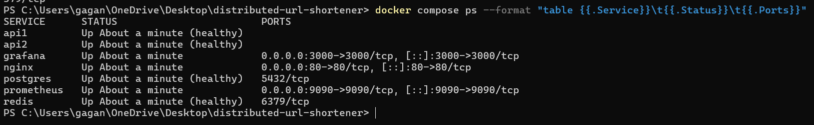

# LinkFlux — Distributed URL Shortener

LinkFlux creates compact links, redirects users through a load-balanced API,
tracks click analytics, and remains available when its cache is unavailable.
It combines a polished React interface with a distributed FastAPI backend,
durable PostgreSQL storage, Redis acceleration, and an observable Docker stack.

[Architecture](docs/ARCHITECTURE.md) · [Technical Specification](docs/TECHNICAL_SPECIFICATION.md) · [Test Report](docs/TEST_REPORT.md)

## Overview

URL shortening looks simple until correctness, concurrency, ownership, latency,
and failure handling matter. LinkFlux demonstrates those engineering concerns in
a complete local system: stateless API replicas share durable state, Nginx
distributes traffic, Redis accelerates redirects, PostgreSQL protects data
integrity, and Prometheus/Grafana make runtime behavior visible.

## Project metrics

| Metric | Value |
|---|---|
| Frontend | React 19 + Vite 8 |
| API replicas | 2 FastAPI instances |
| Load balancer | Nginx `least_conn` |
| Durable database | PostgreSQL 17 |
| Cache and rate limits | Redis 8 |
| Schema migrations | Alembic |
| Monitoring | Prometheus + Grafana |
| Runtime | 8 Compose services including migration job |
| Automated tests | 13 regression + 7 live functional |
| Latest load result | 200/200 health requests; p95 69.86 ms |
| CI | GitHub Actions — passing |

## Key engineering features

- Responsive LinkFlux frontend for registration, login, link management, copy,
  analytics, deletion, and live system status.
- Two stateless FastAPI replicas behind Nginx load balancing.
- PostgreSQL as the durable source of truth with ownership constraints.
- Redis cache-aside redirects with PostgreSQL fallback.
- Redis-backed rate limits shared across API replicas.
- JWT authentication and Argon2 password hashing.
- Collision-safe shortcode creation under concurrent writes.
- Click analytics with non-blocking failure handling on redirects.
- Versioned Alembic migrations applied before API startup.
- Liveness, readiness, degraded-state reporting, and instance tracing.
- Prometheus request/latency metrics and a provisioned Grafana dashboard.
- Unit, functional, concurrency, resilience, and CI verification.

## System architecture



Nginx is the single application gateway. It serves the React frontend at `/`,
routes API and shortcode requests across `api1` and `api2`, and keeps internal
Prometheus metrics unavailable on the public application port. Both replicas
share PostgreSQL and Redis, so request processing remains stateless.

## Application preview

### LinkFlux home



### Link management and click analytics



### Live system status



### Monitoring dashboard



### Interactive API documentation



### Distributed services



## How LinkFlux works

### URL creation

1. The authenticated frontend submits an HTTP(S) destination.
2. Nginx forwards the request to an available API replica.
3. The API generates a cryptographically random shortcode.
4. PostgreSQL's unique constraint provides the final concurrency guarantee.
5. Collisions roll back safely and retry up to ten times.
6. The committed mapping is cached in Redis and returned to the user.

### Redirect flow

```text
Short URL → Nginx → FastAPI → Redis lookup
                                  │
                  ┌───────────────┴───────────────┐
                  │ HIT                           │ MISS / unavailable
                  ▼                               ▼
               Redirect                    PostgreSQL lookup
                                                  │
                                           Populate Redis
                                                  │
                                               Redirect
```

The redirect handler records the click in PostgreSQL. Once a destination is
resolved, a temporary analytics failure does not prevent the redirect.

### Distributed request handling

Nginx distributes API traffic between `api1` and `api2`. Both replicas are
stateless and use the same PostgreSQL and Redis services. Every API response
contains `X-API-Instance`, allowing distribution to be verified directly.

## Authentication and security

- Argon2 password hashing; plaintext passwords are never persisted.
- Signed, expiring JWT bearer tokens for protected endpoints.
- Per-user ownership enforcement for listing, statistics, and deletion.
- Lowercase email normalization and controlled duplicate registration.
- Pydantic validation for emails, passwords, and HTTP(S) destinations.
- Distributed per-IP rate limits for authentication, creation, and redirects.
- Production startup rejection of weak/default JWT secrets.
- Security response headers and a non-root API container user.
- Public `/metrics` access blocked by Nginx.
- Local secrets, virtual environments, caches, and build output excluded from Git.

## Resilience and failure handling

### Redis unavailable

Redirects fall back to PostgreSQL, readiness becomes `degraded`, and cache/rate
limit operations fail open. Redis can be restarted without rebuilding the stack.

### PostgreSQL unavailable

PostgreSQL is the source of truth, so readiness becomes `not_ready` and returns
HTTP 503. Durable creation, management, and uncached resolution cannot continue.

### API replica unavailable

The API layer is stateless. Nginx can route traffic to the remaining available
replica; shared data remains external to both API containers.

## Observability

Prometheus scrapes both API replicas every 15 seconds and records:

- HTTP request totals by instance, method, route, and status.
- Request-duration histograms by instance, method, and route.

Grafana is automatically provisioned with panels for request rate, p95 latency,
and HTTP errors. `/health/live` reports process liveness, while `/health/ready`
reports PostgreSQL and Redis dependency state.

## Verification

| Verification | Result |
|---|---|
| Backend regression tests | 13 passed |
| Live functional tests | 7 passed |
| Frontend production build | Passed; 1,795 modules transformed |
| Python compilation | Passed |
| Docker Compose validation/build | Passed |
| Concurrent health requests | 200/200 successful |
| Measured local latency | p50 35.39 ms; p95 69.86 ms; p99 95.65 ms |
| Concurrent URL creation | 30/30 successful; 30 unique codes |
| Concurrent redirects | 50/50 successful; 50 clicks recorded |
| Load distribution | Both `api1` and `api2` observed |
| Redis failure fallback | Passed; redirect continued with HTTP 307 |
| Prometheus targets | Both replicas up |
| GitHub Actions | Passing |

Measurements describe the tested local machine and are not a public SLA. See
the [Test Report](docs/TEST_REPORT.md) for evidence, traceability, and limitations.

## Technology stack

| Area | Technology |
|---|---|
| Frontend | React, Vite, Lucide icons, Nginx static serving |
| Backend | Python, FastAPI, Uvicorn, Pydantic |
| Data access | SQLAlchemy async, asyncpg |
| Database | PostgreSQL |
| Cache/control | Redis |
| Gateway | Nginx |
| Authentication | JWT, Argon2 |
| Migrations | Alembic |
| Monitoring | Prometheus, Grafana |
| Containers | Docker, Docker Compose |
| Testing | Pytest, HTTPX, live and non-functional suites |
| CI | GitHub Actions |

## Project structure

```text
distributed-url-shortener/
├── app/                         FastAPI application
│   ├── api/                     HTTP routes and dependencies
│   ├── core/                    Configuration, security, middleware
│   ├── db/                      Async database session and metadata
│   ├── models/                  SQLAlchemy entities
│   ├── schemas/                 Pydantic contracts
│   └── services/                Cache and shortcode services
├── frontend/                    React/Vite application and frontend image
├── migrations/                  Alembic migration environment and revisions
├── monitoring/                  Prometheus and Grafana provisioning
├── nginx/                       Public gateway configuration
├── tests/                       Regression, live, and non-functional tests
├── docs/                        Reports, architecture diagram, screenshots
├── .github/workflows/           CI pipeline
├── docker-compose.yml           Complete local topology
├── Dockerfile                   Backend image
└── README.md
```

## Quick start

### Prerequisites

- Docker Desktop
- Git (optional for running, required for cloning)
- PowerShell, curl, or another HTTP client

No separate PostgreSQL, Redis, Nginx, Prometheus, Grafana, Python, or Node
installation is required for the Docker workflow.

### 1. Configure

```powershell
Copy-Item .env.example .env
python -c "import secrets; print(secrets.token_urlsafe(48))"
```

Replace the placeholder `SECRET_KEY` in `.env` with the generated value. Also
set a strong `GRAFANA_ADMIN_PASSWORD`.

### 2. Start

```powershell
docker compose up -d --build --wait
```

The one-shot migration container runs `alembic upgrade head` before either API
replica starts.

### 3. Open

| Service | URL |
|---|---|
| LinkFlux | http://localhost |
| Swagger API | http://localhost/docs |
| Readiness | http://localhost/health/ready |
| Prometheus | http://localhost:9090 |
| Grafana | http://localhost:3000 |

### 4. Stop

```powershell
docker compose down
```

This preserves database and monitoring volumes. `docker compose down -v`
permanently deletes those volumes and should be used only intentionally.

## API reference

| Method | Endpoint | Auth | Purpose |
|---|---|---:|---|
| POST | `/api/auth/register` | No | Register and issue JWT |
| POST | `/api/auth/login` | No | Authenticate and issue JWT |
| POST | `/api/urls` | Yes | Create a short URL |
| GET | `/api/urls` | Yes | List owned URLs |
| GET | `/api/urls/{short_code}/stats` | Yes | Get click count |
| DELETE | `/api/urls/{short_code}` | Yes | Delete owned URL |
| GET | `/{short_code}` | No | Redirect and record click |
| GET | `/health/live` | No | Process liveness |
| GET | `/health/ready` | No | Dependency readiness |

Swagger provides interactive request/response documentation at `/docs`.

## Running tests

Create a local Python environment if one does not exist:

```powershell
python -m venv .venv
.\.venv\Scripts\Activate.ps1
pip install -r requirements.txt
```

### Regression tests

```powershell
pytest -q
```

### Frontend production build

```powershell
Set-Location frontend
npm ci
npm run build
Set-Location ..
```

### Live functional tests

Run the Docker stack first, then:

```powershell
$env:RUN_LIVE_TESTS = "1"
pytest tests/test_live_system.py -q
Remove-Item Env:RUN_LIVE_TESTS
```

### Non-functional tests

```powershell
python tests/nonfunctional_live.py
```

This verifies concurrent traffic, latency, load distribution, unique shortcode
creation, redirects, and click consistency.

## Database migrations

Compose applies committed migrations automatically. After modifying SQLAlchemy
models, generate and review a new revision:

```powershell
docker compose run --rm migrate alembic revision --autogenerate -m "describe change"
docker compose run --rm migrate alembic upgrade head
```

Commit every reviewed file added under `migrations/versions/`.

## Distributed rate limiting

Limits are shared by both API replicas through Redis:

| Category | Default per minute per IP |
|---|---:|
| Authentication | 30 |
| URL creation | 120 |
| Public redirects | 600 |

Configure them with `AUTH_RATE_LIMIT_PER_MINUTE`,
`WRITE_RATE_LIMIT_PER_MINUTE`, and `REDIRECT_RATE_LIMIT_PER_MINUTE`.

## Portfolio demo sequence

1. Open LinkFlux and register or sign in.
2. Create and copy a short link.
3. Open the short link and show the redirect.
4. Refresh My Links and show the click count.
5. Repeatedly request `/health/live` and inspect `X-API-Instance` to demonstrate
   traffic reaching both replicas.
6. Open Grafana and show request rate and latency.
7. Stop Redis with `docker compose stop redis`.
8. Show `degraded` readiness and a working PostgreSQL-backed redirect.
9. Restart Redis with `docker compose start redis`.

## Design decisions

- **PostgreSQL as source of truth:** relational constraints protect ownership,
  uniqueness, and durable click data.
- **Redis as acceleration layer:** cached redirects and shared counters improve
  latency without making Redis mandatory for core resolution.
- **Stateless API replicas:** shared external state allows requests to reach
  either replica safely.
- **Nginx as gateway:** one origin serves the UI and API while balancing requests
  and shielding internal services.
- **Separate Alembic migration job:** schema changes run once before replicas,
  avoiding competing startup DDL.
- **Prometheus and Grafana:** metrics make distribution, latency, and errors
  measurable instead of inferred.
- **Hash-based frontend navigation:** application routes cannot collide with
  public `/{short_code}` paths.

## Known limitations

- Docker Compose currently runs the stack on one host.
- Click analytics are written synchronously during redirect processing.
- The dashboard requests statistics separately for each link.
- JWT logout is client-side and issued tokens are not centrally revoked.
- The fixed-window rate limiter can permit bursts at minute boundaries and fails
  open when Redis is unavailable.
- PostgreSQL, Redis, Nginx, Prometheus, and Grafana are single local instances.
- The current localhost deployment uses HTTP and is not a public hosted service.

## Future scaling

At substantially higher traffic, analytics can be removed from the redirect
critical path:

```text
Client → Nginx → FastAPI → Immediate redirect
                         └→ Event queue → Analytics worker → Storage
```

Additional improvements could include pre-aggregated analytics, centralized
structured logs, automated alerts, managed highly available PostgreSQL/Redis,
token revocation or refresh-token rotation, and multi-host orchestration.

## Documentation

- [Architecture Report](docs/ARCHITECTURE.md) — topology, flows, decisions, and scalability.
- [Technical Specification](docs/TECHNICAL_SPECIFICATION.md) — requirements, contracts, configuration, and acceptance criteria.
- [Test Report](docs/TEST_REPORT.md) — execution evidence, measurements, traceability, and defects.

## License

Licensed under the [MIT License](LICENSE).
