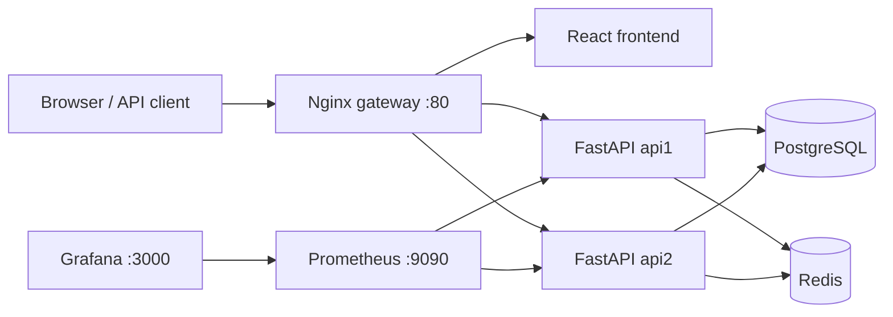
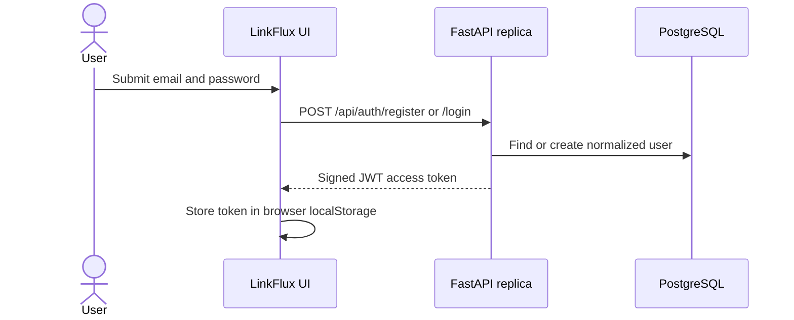
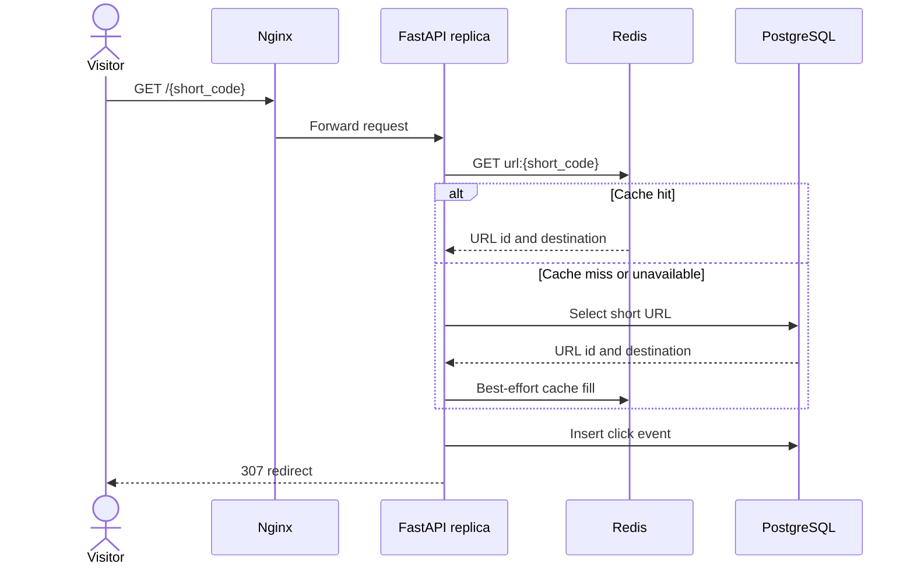
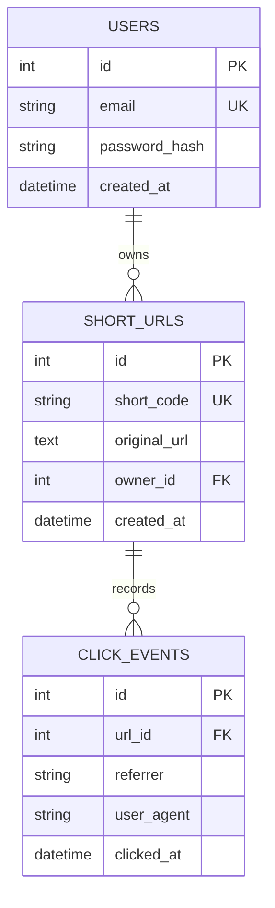
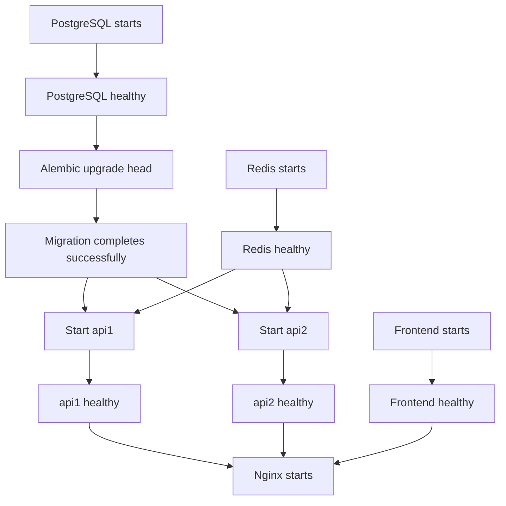

# LinkFlux Architecture Report

## 1. Executive summary

LinkFlux is a containerized URL-management system with a React user interface,
two stateless FastAPI replicas, Nginx load balancing, PostgreSQL persistence,
Redis caching and rate limiting, and a Prometheus/Grafana observability stack.
Docker Compose provides the local runtime and GitHub Actions verifies every
push with unit, build, container, and live integration checks.

The design separates durable state from stateless request processing. API
replicas can therefore serve traffic interchangeably, while PostgreSQL remains
the source of truth and Redis accelerates redirects without becoming a hard
availability dependency.

## 2. System context



All services share the private Docker network `urlnet`. Only Nginx, Prometheus,
and Grafana publish host ports. PostgreSQL, Redis, the frontend container, and
the API replicas are not directly exposed.

## 3. Component responsibilities

| Component | Technology | Responsibility |
|---|---|---|
| LinkFlux UI | React, Vite, Nginx | Registration, login, link management, copy actions, analytics, and system status |
| Public gateway | Nginx | Single public entry point, static asset routing, API proxying, and least-connections load balancing |
| API replicas | FastAPI, Uvicorn | Authentication, URL lifecycle, redirects, analytics, health checks, rate limiting, and metrics |
| Durable store | PostgreSQL 17 | Users, password hashes, owned short URLs, and click events |
| Cache/control store | Redis 8 | Cached URL destinations and distributed per-IP rate-limit counters |
| Schema manager | Alembic | Applies versioned migrations once before API startup |
| Metrics collector | Prometheus | Scrapes request counters and latency histograms from both API replicas |
| Visualization | Grafana | Displays request rate, p95 latency, and HTTP errors |
| Orchestration | Docker Compose | Dependency ordering, networking, health checks, volumes, and local lifecycle |
| Continuous integration | GitHub Actions | Runs tests, compilation, frontend builds, image builds, and live integration tests |

## 4. Gateway and routing

Nginx is the only application-facing entry point on port 80.

| Request path | Destination |
|---|---|
| `/` | React frontend document |
| `/assets/*` | Versioned frontend assets |
| `/api/*` | One of the FastAPI replicas |
| `/health/*` | One of the FastAPI replicas |
| `/docs`, `/openapi.json` | FastAPI documentation |
| `/{short_code}` | FastAPI redirect handler |
| `/metrics*` | Blocked publicly with 404 |

API traffic uses Nginx's `least_conn` algorithm across `api1:8000` and
`api2:8000`. Each API response includes `X-API-Instance`, making distribution
observable during demonstrations and tests.

Frontend navigation uses URL hashes such as `/#/dashboard`. This avoids a
collision between client-side routes and public shortcodes at `/{short_code}`.

## 5. Core request flows

### 5.1 Registration and login



Passwords are hashed with Argon2 and never stored in plaintext. JWTs use HS256,
contain the user identifier in `sub`, and expire according to configuration.
Protected endpoints resolve the token subject to a current database user.

### 5.2 Short URL creation

1. The authenticated client sends `POST /api/urls` with an HTTP(S) URL.
2. The API generates a cryptographically random alphanumeric shortcode.
3. PostgreSQL's unique constraint is the final concurrency guard.
4. On a collision, the transaction rolls back and retries up to ten times.
5. The committed mapping is written to Redis with a configurable TTL.
6. The API returns the short URL and metadata.

### 5.3 Redirect and click tracking



Analytics failure is deliberately non-blocking after a destination has been
resolved. Referrer and user-agent values are truncated to match database limits.

### 5.4 Link deletion

Only the owning user can delete a link. PostgreSQL deletes dependent click
events through cascading relationships, and the corresponding Redis entry is
invalidated after the database commit.

## 6. Data model



PostgreSQL is the durable source of truth. Named Docker volumes persist its data
and Redis append-only state between normal container restarts.

## 7. Caching and graceful degradation

The redirect path uses a cache-aside strategy:

- Reads check Redis first and fall back to PostgreSQL.
- Database results populate Redis for subsequent requests.
- Link creation primes the cache.
- Link deletion invalidates the cache.
- Redis errors are caught so the durable path remains available.

Readiness reports `degraded` when PostgreSQL is healthy but Redis is unavailable.
Redirects continue through PostgreSQL. If PostgreSQL is unavailable, readiness
returns HTTP 503 because durable operations cannot be completed.

## 8. Distributed rate limiting

Redis stores fixed-window counters shared by both API replicas. Limits are
grouped into authentication, URL creation, and public redirect categories and
keyed by client IP and minute bucket. Counter increment and expiry are performed
atomically with a Lua script.

Exceeded limits return HTTP 429 with `Retry-After: 60`. Rate limiting fails open
if Redis is unavailable, matching the project's availability-first cache policy.

## 9. Security model

- Argon2 password hashing.
- Short-lived signed JWT authentication.
- Ownership filtering for listing, statistics, and deletion.
- Pydantic validation for email, password length, and HTTP(S) destinations.
- Production startup rejects weak/default JWT secrets.
- Nginx forwards a controlled client IP instead of trusting arbitrary chains.
- `X-Content-Type-Options`, `X-Frame-Options`, `Referrer-Policy`, and
  `Permissions-Policy` response headers.
- Internal metrics are blocked at the public gateway.
- Containers expose only required ports and the API runs as a non-root user.
- `.env`, virtual environments, caches, and build output are excluded from Git.

The local environment uses HTTP. A public deployment must terminate HTTPS and
use production secrets before accepting real credentials.

## 10. Observability

Each API replica exports Prometheus metrics internally at `/metrics/`:

- `url_shortener_http_requests_total`, labeled by instance, method, route, and status.
- `url_shortener_http_request_duration_seconds`, a latency histogram labeled by instance, method, and route.

Prometheus scrapes both replicas every 15 seconds. Grafana is provisioned with
a Prometheus datasource and the **Distributed URL Shortener** dashboard showing
request rate, p95 latency, and HTTP errors. Health endpoints provide separate
liveness and dependency-readiness signals.

## 11. Startup and migration lifecycle



Schema creation is not performed independently by API replicas. The one-shot
`migrate` service applies committed Alembic revisions first, preventing competing
DDL operations and making schema changes auditable.

## 12. Testing and delivery

The repository contains three verification layers:

1. Unit/regression tests for shortcodes, JWT behavior, validation, header
   handling, rate limiting, and failure behavior.
2. Live black-box tests for frontend delivery, authentication, authorization,
   URL lifecycle, redirects, analytics, and concurrent registration.
3. Non-functional checks for concurrent health traffic, latency percentiles,
   load distribution, unique shortcode creation, concurrent redirects, click
   consistency, and Redis degradation.

GitHub Actions runs two jobs on pushes and pull requests. The `test` job builds
both Python and React code and validates/builds Compose images. The `integration`
job starts the entire stack, runs live tests, captures logs, and removes test
volumes afterward.

## 13. Scalability characteristics

The API layer is stateless and horizontally replicable because shared state is
externalized to PostgreSQL and Redis. Nginx can include additional API instances.
Database indexes support email, shortcode, ownership, and click lookups.

Current deliberate limits:

- Click events are written synchronously on the redirect path.
- Click statistics use a direct aggregate count.
- PostgreSQL and Redis each run as a single local container.
- Prometheus and Grafana are single instances.
- Docker Compose targets one host, not multi-host orchestration.

At materially higher traffic, the next architecture step would move click events
to a queue/consumer, pre-aggregate analytics, use managed highly available data
services, and deploy replicas through an orchestrator.

## 14. Repository map

```text
app/                         FastAPI application
  api/                       Route handlers and dependencies
  core/                      Configuration, security, middleware
  db/                        Async database session and metadata
  models/                    SQLAlchemy entities
  schemas/                   Pydantic request/response contracts
  services/                  Redis cache and shortcode generation
frontend/                    React/Vite user interface and frontend image
migrations/                  Alembic environment and schema revisions
nginx/                       Public gateway configuration
monitoring/                  Prometheus and Grafana provisioning
tests/                       Unit, live, and non-functional tests
.github/workflows/           Continuous integration pipeline
docker-compose.yml           Complete local topology
```

## 15. Architectural decisions

| Decision | Reason | Trade-off |
|---|---|---|
| PostgreSQL as source of truth | Transactions, constraints, ownership relations, durable analytics | Requires database availability for writes and uncached redirects |
| Redis as optional acceleration layer | Fast lookups and shared rate limits | Rate limits fail open during Redis outages |
| Stateless API replicas | Simple horizontal scaling and failover | All mutable state must remain external |
| Nginx as one public gateway | Same-origin UI/API, load balancing, protected internals | Gateway is a single local instance |
| Hash-based frontend navigation | Prevents SPA route collisions with `/{short_code}` | URLs contain `#` for application screens |
| Synchronous click writes | Strong immediate analytics consistency and simple design | Adds database latency to redirects |
| Alembic migration job | Deterministic versioned schema startup | Migration failure blocks API startup by design |

## 16. Operational commands

```powershell
# Start and wait for healthy services
docker compose up -d --build --wait

# Inspect service health
docker compose ps

# Run local tests
.venv\Scripts\python.exe -m pytest -q

# Run live tests
$env:RUN_LIVE_TESTS = "1"
.venv\Scripts\python.exe -m pytest tests\test_live_system.py -q
Remove-Item Env:RUN_LIVE_TESTS

# Stop while preserving data
docker compose down
```

Destructive reset command `docker compose down -v` removes all local database,
cache, Prometheus, and Grafana volumes and should be used only intentionally.
